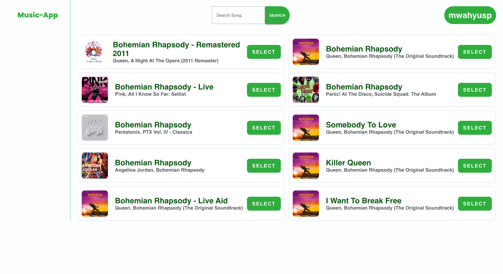

# MusicApp - Create Playlist

This is my final project submission for [#GenerasiGIGIH-Frontend-Track](https://sites.google.com/anakbangsabisa.org/generasigigih-landingpage/home?authuser=1)

<p align="center">
  
</p>

<p align="center">
Create spotify playlist app. 
</p>

[Live preview.](https://generasi-gigih-homework-mwahyusp.vercel.app/)

## Features

- 🔉 Built-in web player
- 📐 It's simplifies UI
- 😎 It has 💯 cool transition™ 💯
- ✨ etc.

## Built Using

- [Create React App](https://create-react-app.dev/) to initialize the project.
- [Material-ui ⚡](https://material-ui.com/docs/getting-started) for layout & styling.
- [React redux](https://react-redux.js.org/) for state management.
- [Hosted on Vercel 🚀](https://vercel.com/).

## Environment Variables

To run this project, you will need to add the following environment variables to your .env file

`REACT_APP_BASE_URL` used for grant flow callback.

`REACT_APP_SPOTIFY_CLIENT_SECRET` your spotify developer client secret.

`REACT_APP_SPOTIFY_CLIENT_ID` your spotify developer client id.

see [.env.example](/.env.example)

## Run Locally

Clone the project

```bash
  git clone https://github.com/mwahyusp/generasi-gigih-homework
```

Go to the project directory

```bash
  cd generasi-gigih-homework
```

Install dependencies

```bash
  yarn
```

Start the server (but you need to [setup .env](#environment-variables) first)

```bash
  yarn start
```

Open http://localhost:3000 with your browser to see the result.

## Feedback

Any feedback is welcome, you can sumbit issues/feedback [here](https://github.com/mwahyusp/generasi-gigih-homework/issues).

## License

Licensed under [MIT License, Copyright (c) 2021 mwahyusp](./LICENSE)
